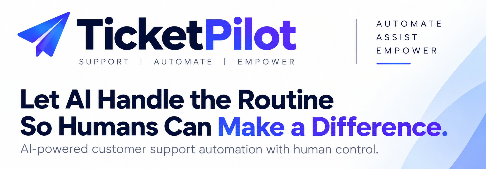
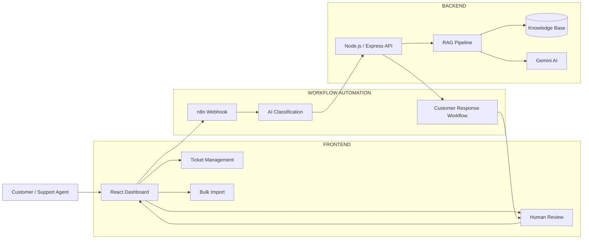
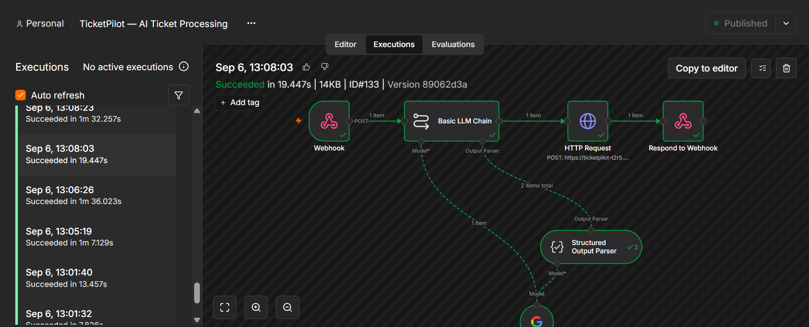
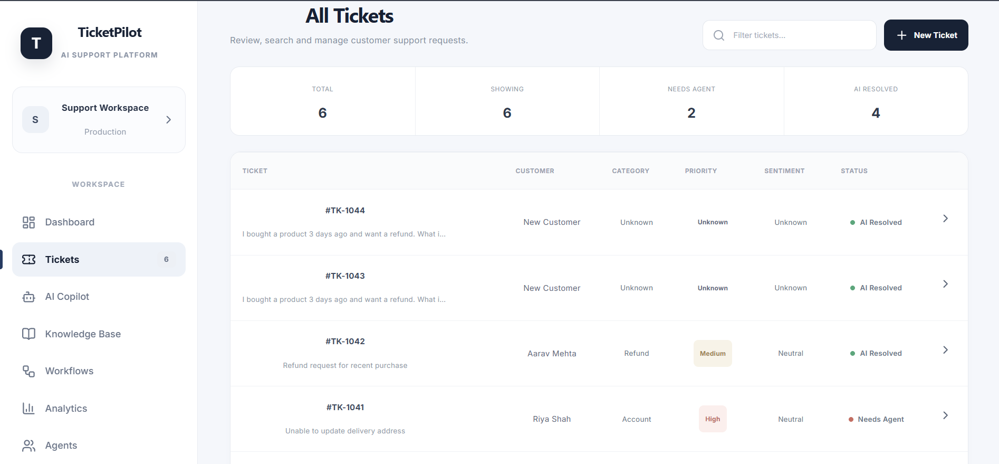
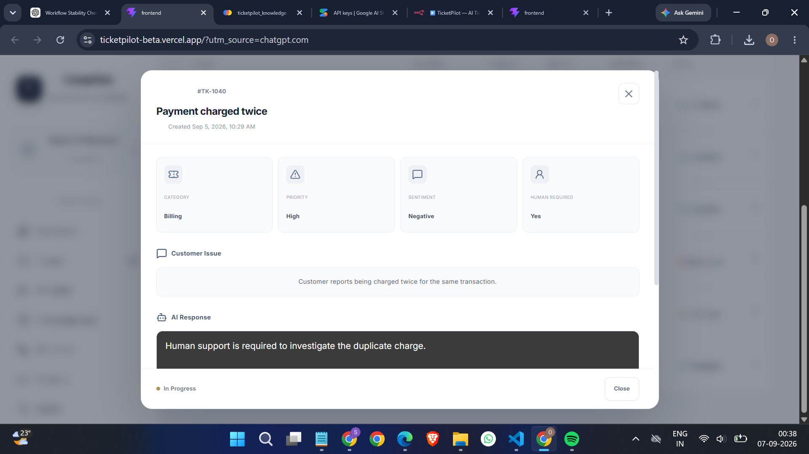
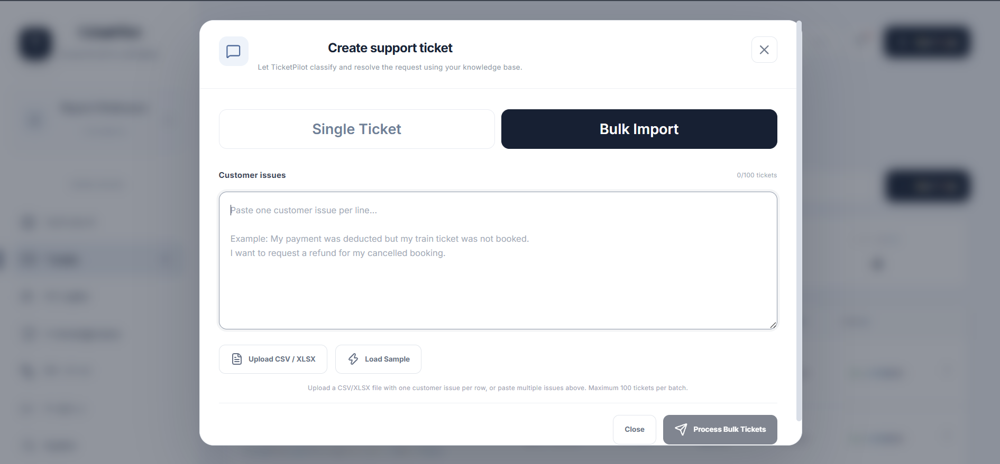

  

  <b>AI-powered customer support automation with human control</b>

  Classify • Prioritize • Assist • Review • Resolve

---
##  Overview

TicketPilot is an AI-powered customer support platform designed to automate ticket analysis, response generation, and routine support operations while keeping human agents in control of complex cases.

The system combines AI-based ticket classification, priority and sentiment analysis, Retrieval-Augmented Generation (RAG), knowledge-base retrieval, automated response assistance, bulk ticket processing, and human-in-the-loop review into a unified customer support workflow.

### What it does

1.  **AI Ticket Classification** — Automatically classify customer support tickets.
2.  **Priority Detection** — Identify the urgency of incoming customer issues.
3.  **Sentiment Analysis** — Analyze customer sentiment and identify negative or sensitive cases.
4.  **Human Escalation** — Identify tickets that require human intervention.
5.  **RAG-based Assistance** — Retrieve relevant information from the knowledge base to support AI responses.
6.  **AI Response Generation** — Generate responses based on the customer's issue and retrieved knowledge.
7.  **Source Transparency** — Display the documents and retrieved information used to generate responses.
8.  **Human Review** — Allow support agents to review AI-generated ticket analysis and responses.
9.  **Approve & Send** — Allow agents to approve an AI-generated response for the customer.
10. **Edit & Send** — Allow agents to modify an AI response before approving it.
11. **Manual Takeover** — Allow human agents to take control of tickets requiring direct handling.
12. **Bulk Ticket Import** — Process multiple support tickets from CSV, XLSX, and XLS files.
13. **Workflow Automation** — Automate ticket processing through n8n workflows.
14. **Ticket Dashboard** — Monitor tickets, AI analysis, responses, review status, and resolution in one interface.

The architecture is designed so that the frontend, workflow automation, backend API, RAG pipeline, and human review layers remain separated, making the system easier to scale with additional support channels, knowledge sources, and AI-powered capabilities.

---

##  System Architecture

---

##  Processing Pipeline

**Ticket Input → React Dashboard → n8n → AI Classification → Backend API → RAG → Gemini AI → AI Response → Human Review → Resolution**

| Stage | Function |
|---|---|
| Ticket Input | Receive customer support issues |
| AI Classification | Identify category, priority, sentiment, and review requirement |
| Workflow Automation | Process tickets through n8n |
| Backend API | Handle ticket processing through the Node.js API |
| RAG Pipeline | Retrieve relevant information from the knowledge base |
| Gemini AI | Generate an AI-assisted response using retrieved information |
| Human Review | Review, approve, edit, or take over tickets |
| Resolution | Resolve the ticket or continue human handling |

---

---

##  Dashboard

TicketPilot provides a centralized support dashboard for managing incoming tickets, AI analysis, human review, and resolution.

---

##  Dashboard

The web dashboard provides a centralized interface for managing customer support tickets, AI analysis, human review, bulk imports, and ticket resolution.

### Main Dashboard

  

  

### Ticket Analysis

  

### Human Review

  

### Bulk Ticket Import

  

### AI Copilot

  

---

---

##  Technology Stack

| Category | Technology |
|---|---|
| Programming Language | JavaScript |
| Frontend | React |
| Build Tool | Vite |
| Styling | CSS |
| UI Icons | Lucide React |
| File Processing | SheetJS |
| Workflow Automation | n8n |
| Backend API | Node.js / Express |
| Artificial Intelligence | Google Gemini |
| RAG | ChromaDB / Vector Retrieval |
| Knowledge Base | Document-based Knowledge Base |
| Frontend Deployment | Vercel |
| Backend Deployment | Render |
| Workflow Hosting | n8n Cloud |
| Version Control | Git / GitHub |

---
